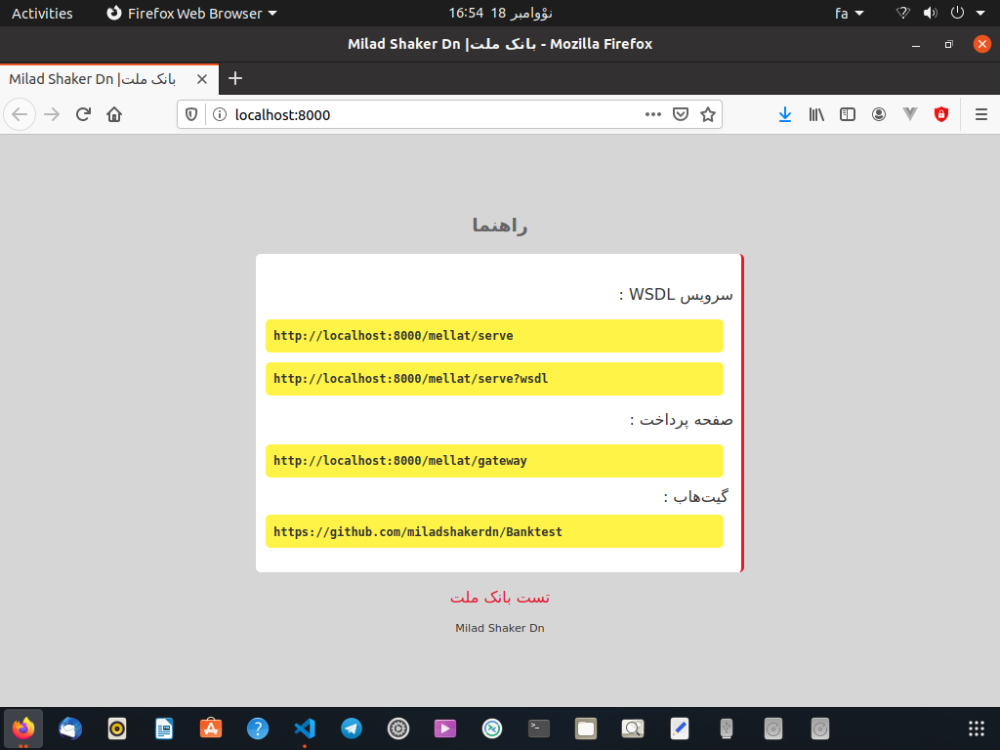

# Bank test

<div style="text-align:right;" dir="rtl">

# شبیه‌ساز بانک ملت

<p>
استفاده از درگاه آنلاین بانک ملت نیازمند دریافت نماد اعتماد الکترونیک است و همچنین API برای تست ندارد، این پروژه برای شبیه‌سازی پرداخت آنلاین بانک ملت است.
</p>

<strong>متد‌های موجود شامل :</strong>

<p>
<pre style="text-align:left;" dir="ltr">
1- bpPayRequest
2- bpVerifyRequest
3- bpSettleRequest
4- bpInquiryRequest
5- bpReversalRequest
</pre>
</p>

<strong>وابستگی ها</strong>

توجه! لازم است که SOAP نصب باشد.

[#راهنمای نصب SOAP](#نصب-soap-برای-php)


<div style="text-align:left;"  dir="ltr">
    
- [x] PHP ^7.3
- [x] PHP soap
    
</div>

## نصب

نصب با استفاده از کامپوزر. برای این شبیه ساز از فریمورک [Lumen](https://lumen.laravel.com/docs/8.x) استفاده شده.

<div style="text-align:left;" dir="ltr">

```bash
git clone https://github.com/miladshakerdn/banktest.git

cd banktest

#Install Lumen

composer install
```

<div style="text-align:right;" dir="rtl">
    
فایل <span style="text-align:left;" dir="ltr"> `.env` </span> را باز کرده و اطلاعات دیتابیس را وارد کنید.
</div>

سپس با دستور زیر دیتابیس و داده‌های اولیه را ایجاد کنید:

```bash
#open .env and set your db information
#migrate database
php artisan migrate
php artisan db:seed
```

</div>

## نحوه استفاده

مطابق مستندات ارائه شده توسط بانک ملت عمل کرده و مانند درگاه واقعی بانک ملت عمل میکند.

اطلاعات اولیه پذیرنده شامل:

<div style="text-align:left;" dir="ltr">

| Name           | Value                                            |
| -------------- | ------------------------------------------------ |
| Terminal ID    | 123625346124                                     |
| Username       | admin                                            |
| Password       | admin                                            |
| WSDL URL       | http://your-server:PORT/mellat/serve?wsdl        |
| Gateway URL    | http://your-server:PORT/mellat/gateway           |
| ---            | ---                                              |
| Or WSDL URL    | http://your-localhost/bankTest/mellat/serve?wsdl |
| Or Gateway URL | http://your-localhost/bankTest/gateway           |

</div>
برای متوجه شدن لینک دقیق می‌توانید صفحه اصلی پروژه را در مرورگر باز کرده تا از آن مطلع شوید.

<div style="text-align:left;" dir="ltr">

```bash
# If use =>  php -S your-server:PORT -t public
your-server:PORT
# OR
your-localhost/bankTest/
```



</div>


## نصب SOAP برای PHP

#### برای Linux (Ubuntu)

<div style="text-align:left;" dir="ltr">
    
Apache
```
sudo apt-get install php-soap
# For example, a specific version of php (7.4)
sudo apt-get install php7.4-soap

# Then
sudo systemctl restart apache2

```
</div>

#### برای ویندوز

<div style="text-align:left;" dir="ltr">

1. Find `extension=php_soap.dll` or `extension=soap` in `php.ini` and remove the commenting semicolon at the beginning of the line. Eventually check for `soap.ini` under the `conf.d` directory.

2. Restart your server.

</div>

[در stackoverflow](https://stackoverflow.com/a/22397686)


</div>
